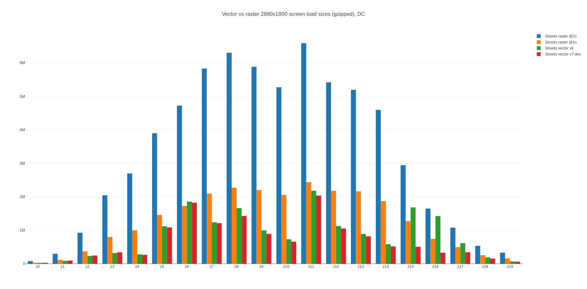
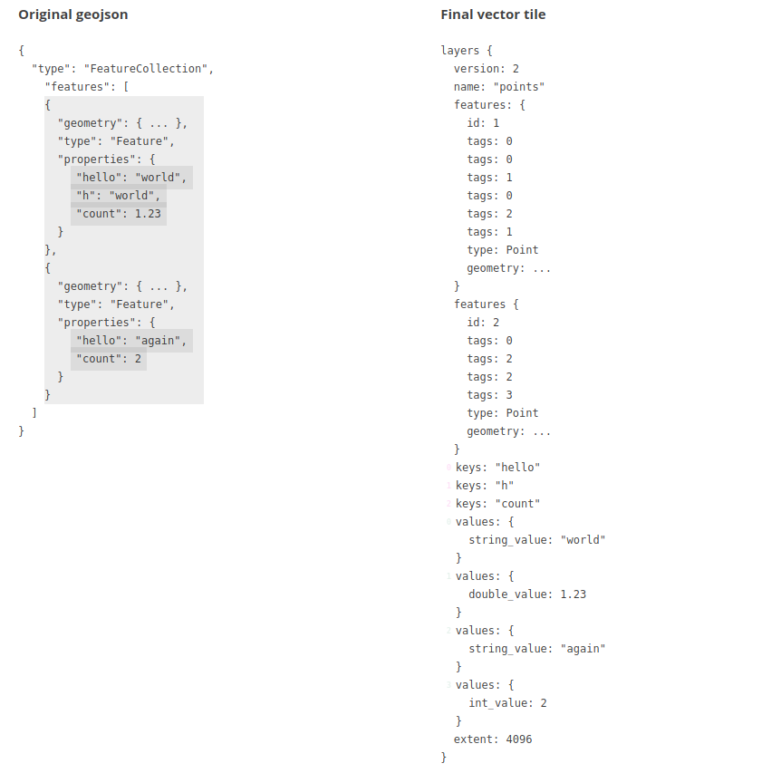
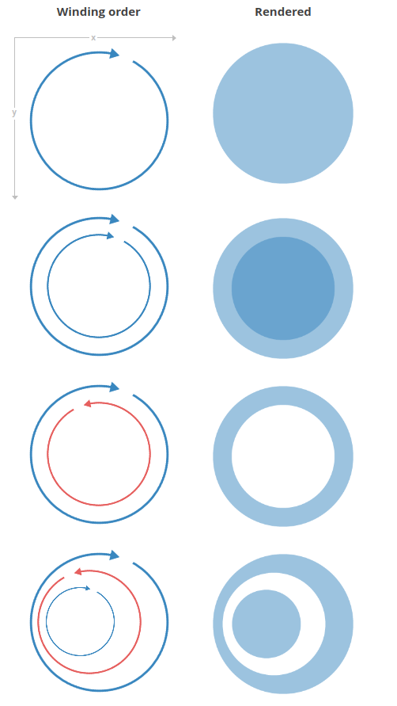
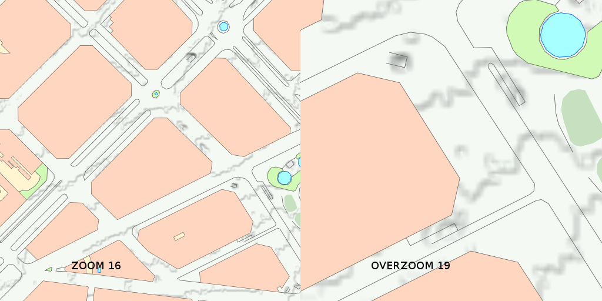
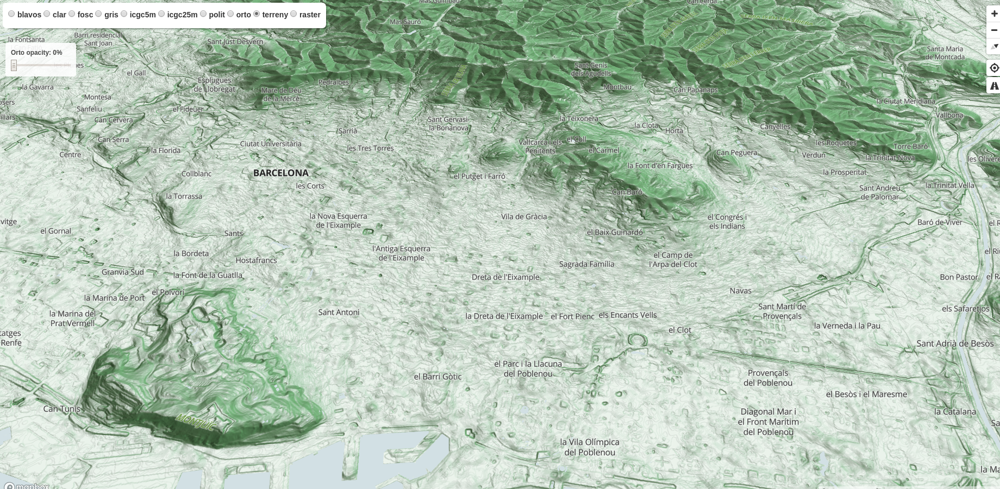
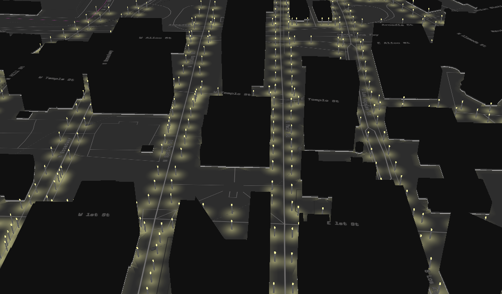
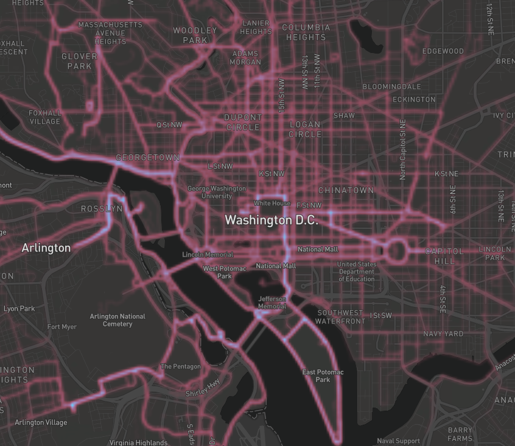

# Qué son las teselas vectoriales

Las teselas vectoriales son un formato de datos liviano para almacenar datos vectoriales geoespaciales, como puntos, líneas y polígonos. Las teselas vectoriales codifican información geográfica de acuerdo con la especificación de teselas vector de Mapbox. La especificación de Mapbox es un estándar abierto bajo una licencia Creative Commons Attribution 3.0 US.

Una tesela vectorial (vector tiles) contiene datos vectoriales georreferenciados (puede contener múltiples capas), recortados en teselas para facilitar su recuperación. Son equivalentes a las teselas raster tradicionales (WMTS, TMS) pero retornan datos vectoriales en lugar de una imagen.

Cada conjunto de teselas vectoriales tiene su propio esquema. Un esquema consiste en nombres de capas, atributos, selección de elementos, etc.

No existe un esquema que sirva para todo. Existen varios esquemas como por ejemplo: OpenMapTiles, Mapbox Streets, etc.

!!! warning
    Las teselas vectoriales no son un formato de datos vectoriales estilo Shapefile, GeoJSON, etc. pensado para trabajar (hacer análisis, explotación de datos, etc.) sino que está pensado y enfocado principalmente en la visualización.

## Un poco de Historia

!!! example "Fechas destacadas"

    * 1966 Sistema de Información Geográfica de Canadá (CGIS) utiliza “marco” para almacenar información
    * 1975 Servicio de Vida Silvestre EE.UU. utiliza “geounit” para almacenar datos
    * Finales de 1980 teselas se vuelven “invisibles” para el usuario final. Manejo de datos continuo
    * Abril 2014 Mapbox saca la version 1.0 de la especificación Mapbox Vector Tile

Existe una larga historia de uso de teselas vectoriales en SIG. En 1966 el Sistema de Información Geográfica de Canadá (CGIS), utilizaba un esquema de almacenamiento vectorial que permitía a las computadoras de recursos limitados acceder de manera eficiente y procesar datos de mapas vectoriales. CGIS usó el término "marco" en lugar de teselas vectoriales.

En 1975, el Servicio de Vida Silvestre de los EE.UU. inició un programa nacional para mapear y digitalizar todos los humedales de los EE.UU. En 1976 desarrollan un software que se llamó WAMS (Wetlands Analytical Mapping System). El almacenage de datos del WAMS usaba una estructura de teselas vectorial. Cada tesela se llamaba "geounit". Una geounit correspondía a una de las escalas cuadrangulares del USGS, generalmente 1:24000.

En 1986 basándose en la experiencia operativa adquirida en la implementación y el uso de WAMS y del Map Overlay and Statistical System (MOSS), se lanzó un SIG comercial DeltaMap (más tarde GenaMap) basado en UNIX que implementó una estructura mejorada de almacenamiento y acceso de teselas vectores. DeltaMap permitió al usuario definir cualquier tamaño de tesela en cualquier sistema de referencia de coordenadas (CRS). De esta forma, los datos dispersos requerían solo unas pocas teselas, mientras que los datos densos podían usar teselas mucho más pequeñas. Utilizaban R-trees como el esquema de indexación para las teselas de vectores.

A finales de la década de 1980, se mejoró aún más GenaMap para permitir el procesamiento "continuo e ininterrumpido" de las capas de teselas. Básicamente, desde la perspectiva del usuario final, las teselas se volvieron invisibles. [^1]

[^1] https://en.wikipedia.org/wiki/Vector_tiles

Abril de 2014 Mapbox saca la version 1.0 de la especificación Mapbox Vector Tile (MVT).

Diciembre 2015 versión 2.0 de la especificación MVT.

Marzo de 2015 ESRI (el que no debe ser nombrado) anuncia que soportará MVT.

Mapbox actualmente está trabajando en la versión 3.

## Diferencias entre teselas raster y teselas vectoriales

| Tesalas vectoriales | Teselas raster |
|---|---|
|Estilo se define en el cliente|Estilo se define en el servidor|
|Sólo se necesita teselar la información una sola vez y se pueden tener múltiples mapas|Hay que teselas la información para cada mapa|
|*Overzoom* se mantiene resolución|*Overzoom* pierde resolución (pixelado)|
|Menor tamaño (se recomienda máximo 500kb)|Más fáciles de consumir|
|Cache ocupa mucho menos espacio. Fáctible el uso en dispositivos móviles sin conexión|Cache ocupa mucho espacio. Uso en dispositivos móviles requiere mucho espacio de disco|
|Acceso nativo a la información del objeto (atributos y geometría), lo que permite un procesamiento muy sofisticado||
|Se ven mejor en dispositivos de alta resolución||

Comparativa pesos teselas vector vs raster. Fuente https://plot.ly/~mourner/118.embed

### Comparación con otros formatos

|Teselas Vectoriales|WMS|WMTS|WFS|
|---|---|---|---|
|Nivel de zoom continuo|Nivel de zoom continuo|Nivel de zoom discreto|Nivel de zoom continuo|
|Teselado|No teselado, con lo cual no hay problemas de etiquetas|Teselado|No teselado|
|Retorna datos en vector modificados (generalizados, simplificados)|Retorna imagen raster|Retorna imagen raster|Retorna datos en vector sin modificar|
|Cache tanto en cliente como en servidor|No cache|Cache tanto en cliente como en servidor|No cache|
|Escalabilidad||Escalabilidad||
|Interactivo|No interactivo (se pueden hacer consultas getFeatureInfo)|No interactivo|Interactivo|
|Estilo flexible (cliente es quien define el estilo)|Estilo fijo (se puede modificar via SLD pero lo renderiza el servidor)|Estilo fijo (definido en el servidor)|Estilo flexible|
|Impresión Hi-DPI|Impresión problemas con Hi-DPI|Difícil impresión (montar el mosaico de imáges y problemas con Hi-DPI)|Impresión Hi-DPI|

## Cómo están hechas por dentro

Las geometrías y los atributos se codifican como datos binarios de Google Protobuf (PBF).

### Codificar geometrías

Para codificar información geográfica en una tesela vectorial, una herramienta debe convertir las coordenadas geográficas, como la latitud y la longitud, en coordenadas vectoriales de cuadrículas. Las teselas de vectoriales no tienen ningún concepto de información geográfica. Codifican puntos, líneas y polígonos como pares x/y relativos a la esquina superior izquierda de la cuadrícula de forma descendente.

Las geometrías son transformadas a una sola tesela, con un sistema de coordenadas de píxel local, que por defecto va de la esquina superior izquierda (0,0) a la esquina inferior derecha (4096,4096).

Codificar geometría. Fuente https://www.mapbox.com/vector-tiles/specification/#encoding-geom

### Codificar atributos

Los atributos se codifican como un conjunto único de claves (algo así como un esquema de campos de capa) y la lista de sus valores.

Los atributos están codificados en una serie de etiquetas que existen dentro de un elemento en el vector que tienen valores enteros que hacen referencia a las claves y los valores que provienen de la geometría. Esto elimina la redundancia de los atributos para geometrías que tienen las mismas claves y valores similares.

Codificar atributos. Fuente https://www.mapbox.com/vector-tiles/specification/#encoding-attr

### Winding order

El *Winding order* (dirección de digitalización) se refiere a la dirección en que se dibuja un anillo en un mosaico vectorial, ya sea en sentido horario o antihorario. Muchas geometrías son multipolígonos con "agujeros", que también se representan como anillos de polígono. Es importante poder inferir el orden al extraer datos fuente de un mosaico vectorial y comprender si la geometría es parte de un polígono múltiple o un polígono único.

Para que los procesadores distingan de manera apropiada que polígonos son agujeros y cuáles son geometrías únicas, la especificación requiere que todos los polígonos sean válidos (validez de OGC). Cualquier anillo interior poligonal debe orientarse con el orden opuesto al de su anillo exterior principal y todos los anillos interiores deben seguir directamente el anillo exterior al que pertenecen. Los anillos exteriores deben estar orientados en el sentido de las agujas del reloj y los anillos interiores deben estar orientados en sentido contrario a las agujas del reloj.

Winding order. Fuente https://www.mapbox.com/vector-tiles/specification/#winding-order

## Diferentes especificaciones y conceptos relacionados con las teselas vectoriales

### pbf

**Protocol buffers** desarrollado por Google (para uso interno) es un método para serializar datos estructurados. Es *language-neutral*, *platform-neutral* y en cuyo objetivo de diseño enfatizaron la simplicidad y el rendimiento.

El método implica un lenguaje de descripción de interfaz que describe la estructura de algunos datos y un programa que genera código fuente a partir de esa descripción para generar o analizar una secuencia de bytes que representa los datos estructurados.

### mvt

Formato binario basado en la especificación de Mapbox que usa **pbf** para serializar datos geográficos. Los archivos deberían tener extensión .mvt pero no es obligatorio así que se pueden encontrar archivos con extensión .pbf, .vector.pbf o .mvt.gz (compresión gzip)

Por ejemplo un conjunto de teselas mvt almacenadas en un SQLite siguiendo una esquema específico formaría un MBTiles.

### MBTiles

**MBTiles** es un formato de archivo para almacenar conjuntos de teselas. Está diseñado para que pueda empaquetar los potencialmente miles de archivos que componen un conjunto de teselas y moverlos, usarlos en una aplicación web o móvil. MBTiles es una especificación abierta y se basa en la base de datos SQLite. MBTiles puede contener conjunto de teselas reaster y/o vector.

MBTiles es una especificación compacta y restrictiva. Sólo admite datos teselados, incluidas teselas vectoriales o de imágenes y UTFGrid (hasta la versión 1.2). Sólo la proyección esférica de Mercator es soportada para la presentación (visualización) y sólo se admiten coordenadas de latitud y longitud para metadatos, como límites y centros.

Es una especificación mínima, que soló especifica las formas en que los datos deben ser recuperables. Por lo tanto, los archivos MBTiles pueden comprimir y optimizar datos internamente, y construir vistas que se adhieren a la especificación MBTiles. Dentro del MBtiles los vectores estan almacenados comprimidos (gzip) y en formato pbf.

A diferencia de Spatialite, GeoJSON y Rasterlite, MBTiles no es un almacenamiento de datos sin formato. Es almacenamiento de datos en teselas.

### tilejson

**TileJSON** es un formato para describir un conjunto de teselas. Realiza un seguimiento de dónde solicitar el conjunto de teselas, el nombre del conjunto de teselas y cualquier atribución que sea necesaria al utilizar el conjunto de teselas.

Esta especificación intenta crear un estándar para representar metadatos sobre múltiples tipos de capas, para ayudar a los clientes en la configuración y navegación.

### Overzoom

*Overzooming* es una técnica específica de teselas vectorial que permite que una tesela se represente más allá de su nivel de zoom previsto, por lo que continúa siendo visible en el mapa. Si un conjunto de teselas tiene un minzoom de 6 y un maxzoom de 12, esos son los rangos válidos calculados por el generador de teselas. Si ampliara el mapa más allá del nivel de zoom 12, el renderizador del mapa puede seguir utilizando los datos del zoom 12 escalando los datos del vector hacia arriba. Esto, por supuesto, puede dar lugar a grandes simplificaciones de datos si las geometrías se representan demasiado por encima de su nivel real de detalle.

Las teselas raster pierden claridad si ocurre overzoom. Por ejemplo, si está visualizando un conjunto de teselas raster con una extensión de zoom entre z0 y z6, si hace un zoom a un nivel de zoom más alto después de z6, las imágenes se volverán borrosas y difíciles de ver.

Los efectos del overzoom no son tan notables con las teselas vector, ya que los datos vectoriales no se almacenan en un formato basado en píxeles, sino que se codifican y calculan a partir de una serie de puntos, líneas y polígonos.

Overzoom nivel zoom 16 vs nivel zoom 19.

## Presentación de ejemplos visuales hechos con vt

### Terreno

https://openicgc.github.io/

### Luces LA

### Edificios con música

https://codepen.io/jwhazel/pen/NYzpWG

blog explicativo https://medium.com/@erdag/mappox-mapmadness18-round-4-1251a8c10421

### Temático filtro

### Mapa de calor

## Esquema general de lo que se va a hacer en el taller

Esquema taller
