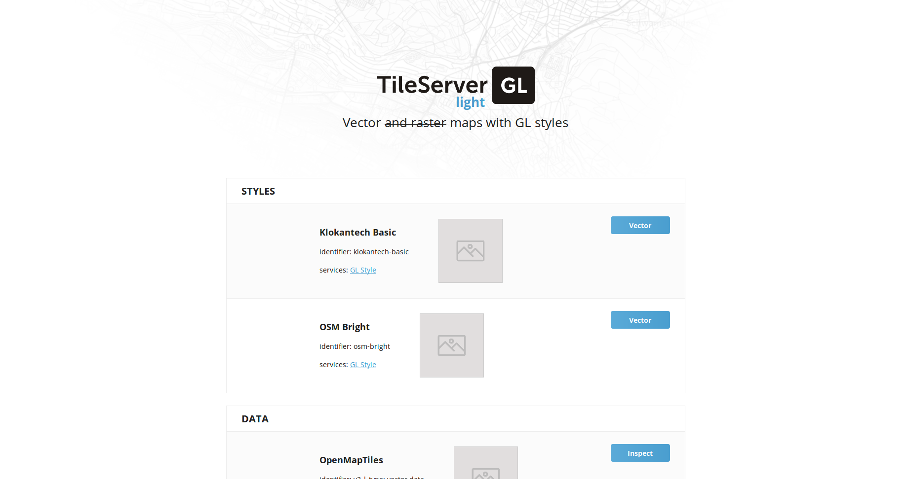

# Cómo servir teselas vectoriales

## TileServer GL

El [TileServer GL](http://tileserver.org/) es un servidor de mapas de código abierto creado para teselas vectoriales, y capaz de renderizar en teselas raster con MapBox GL Native engine en el lado del servidor.

Proporciona mapas para aplicaciones web y móviles. Es compatibles con Mapbox GL JS, Android SDK, iOS SDK, Leaflet, OpenLayers, HighDPI/Retina, SIG a través de WMTS, etc.

Si se quiere servir teselas raster lo mejor es utilizar la versión de Docker ya que son necesarias algunas librerías nativas que pueden variar dependiendo de la plataforma, estas librerías sirven para renderizar las teselas vectoriales en teselas raster. Si únicamente se quiere servir teselas vectoriales se puede utilizar el TileServer GL Light que no tiene ninguna dependencia nativa ya que está desarrollado en javascript.

### Instalación

Para este taller utilizaremos la versión Light ya que serviremos sólo teselas vectoriales.

Para instalar el TileServer GL Light es necesario tener instalado el [Node.js](https://nodejs.org/es/) versión 6 o superior. Una vez instalado el Node.js

* Abrir el terminal y escribir `npm install -g tileserver-gl-light`

* Comprobar la instalación. Escribir `tileserver-gl-light -v`. En el terminal debe aparacer un mensaje con la versión del TileServer instalada. 

### Probar el servidor

* Crear una carpeta llamada *datos* dentro del directorio de trabajo **taller-vt**. Escribir en la terminal `mkdir datos`

* Escribir `cd datos` para entrar en el directorio de datos.

* Descargar los datos. Para ello ir [OpenMapTiles](https://openmaptiles.com/downloads) y descargar el archivo **OpenStreetMap vector tiles** del área que se quiera dentro del directorio *datos*. Para este taller descargaremos el archivo de [Barcelona](https://openmaptiles.com/downloads/europe/spain/barcelona/)

* Escribir `tileserver-gl-light 2017-07-03_spain_barcelona.mbtiles -p 8181`. El parámetro -p es para indicar el puerto. Por defecto el TileServer usa el puerto 8080. Como nuestro servidor web está utilizando el puerto 8080, utilizaremos el puerto 8181 para el TileServer.

* Abrir el navegador y escribir http://localhost:8181 y comprobar que aparece la página del TileServer.


*TileServer GL Light*

### Descargar el estilo 

* Crear una carpeta llamada *styles* dentro del directorio de trabajo **taller-vt**. Escribir en la terminal `mkdir datos`

* Escribir `cd styles` para entrar en el directorio de estilos. 

* Descargar el estilo [OSM Bright de OpenMapTiles](https://openmaptiles.org/styles/#osm-bright) dentro de la carpeta *styles*. El archivo de estilo se puede descargar directamente desde [este enlace])https://github.com/openmaptiles/osm-bright-gl-style/blob/master/style.json) 

* Editar el archivo descargado style.json para que cargue los datos desde nuestro servidor local. Para ello modificar la línea 51 y reemplazar la url por `http://localhost:8080/data/v3.json`

```js hl_lines="5"
...
    "sources": {
        "openmaptiles": {
            "type": "vector",
            "url": "http://localhost:8181/data/v3.json"
        }
    },
...  
``` 

### Modificar el visor de mapas

Modificaremos nuestro archivo *index.html* para que el visor de mapas consuma las teselas vectoriales servidas por el TileServer.

``` html hl_lines="22"
<!DOCTYPE html>
<html>
<head>
    <meta charset="UTF-8">
    <meta name="viewport" content="width=device-width, initial-scale=1">
    <title>Mapa VT</title>
    <link rel='stylesheet' href='https://api.tiles.mapbox.com/mapbox-gl-js/v0.44.1/mapbox-gl.css' />
    <script src='https://api.tiles.mapbox.com/mapbox-gl-js/v0.44.1/mapbox-gl.js'></script>
    <link href='https://mapbox-gl-inspect.lukasmartinelli.ch/dist/mapbox-gl-inspect.css' rel='stylesheet' />
    <script src='https://mapbox-gl-inspect.lukasmartinelli.ch/dist/mapbox-gl-inspect.min.js'></script>
    <style>
        html, body {
            margin: 0;
            height: 100%;
        }
    </style>
</head>
<body id='map'>
<script>
    var map = new mapboxgl.Map({
        container: 'map', // id del elemento HTML que contendrá el mapa
        style: './styles/style.json', // Ubicación del estilo
        center: [2.175, 41.39], // Ubicación inicial
        zoom: 13, // Zoom inicial
        bearing: -45, // Ángulo de rotación inicial
        hash: true // Permite ir guardando la posición del mapa en la URL
    });

    // Agrega controles de navegación (zoom, rotación) al mapa:
    map.addControl(new mapboxgl.NavigationControl());

    // Agregar el control de inspección
    map.addControl(new MapboxInspect());
</script>
</body>
</html>
```

Se recargará la página en el navegador y vemos que nuestro mapa deja de funcionar. Abrir la consola del desarrollador (F12) y ver que aparecen una serie de errores que hacen que no se vea el mapa.

El primer error que vemos hace referencia a que no existe la capa *aerodrome_label* en nuestro archivo de teselas vectoriales. En nuestro estilo buscamos la capa *aerodrome_label* y la borramos (líneas 4286 hasta 4323). Se recargará la página y comprobamos que el error que hacía referencia a la capa *aerodrome_label* ha desaparecido, pero seguimos teniendo errores.

El siguiente error hace referencia a que no puede cargar los archivos con las fuentes para pintar las etiquetas del mapa. Si vamos a la línea 55 de nuestro archivo de estilos observamos que en la url de carga solicita una llave (**key**). Para obtener esta **key** hay que registrarse (tienen un plan gratuito) en [Tilehosting](https://www.tilehosting.com/).

Sustituir en la url del glyphs (línea 55) donde dice **{key}** por nuestra key. Para no tener que generar una key en este taller podremos usar *RiS4gsgZPZqeeMlIyxFo*. 

!!! warning "Nota"
    Para desplegar un mapa en producción o fuera del ámbito del taller se debe usar la key propia.

```js hl_lines="3"
...
  "sprite": "https://openmaptiles.github.io/osm-bright-gl-style/sprite",
  "glyphs": "https://free.tilehosting.com/fonts/{fontstack}/{range}.pbf?key=RiS4gsgZPZqeeMlIyxFo",
  "layers": [
...  
``` 

Se recargará la página en el navegador y comprobamos que desaparecen los errores y que se ve nuestro mapa.
