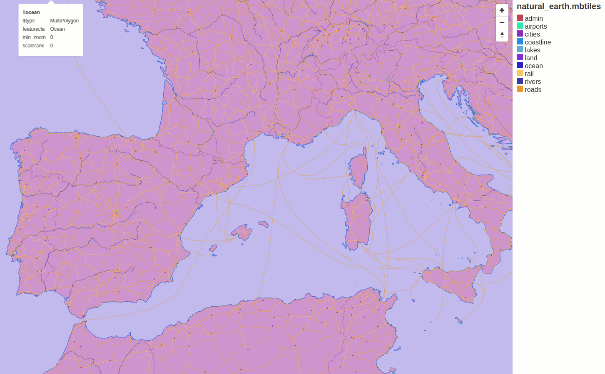

# Cómo crear teselas vectoriales

## Los datos de Natural Earth

En el apartado de descargas de [Natural Earth](http://www.naturalearthdata.com/) hay varios conjuntos de datos
en formato Shapefile, según la escala. En el taller trabajaremos con un subconjunto de los datos de la escala 1:10M
(1:10.000.000). Para ahorrarnos la transformación de Shapefile a GeoJSON, utilizaremos los datos procedentes de
[https://github.com/nvkelso/natural-earth-vector/](https://github.com/nvkelso/natural-earth-vector/tree/master/geojson).

En concreto usaremos las siguientes capas:

* Cultural
    * Admin 0 – Countries (247 países en el mundo. Groenlandia separada de Dinamarca)
    * Populated Places (Puntos de ciudades y pueblos)
    * Roads (Carreteras principales)
    * Railroads (Vías de Trenes)
    * Airports (Aeropuertos)
* Physical
    * Coastline (Línea de costa que incluyen islas principales)
    * Land (Polígonos terrestres que incluyen islas principales)
    * Ocean (Oceano)
    * Rivers + lake centerlines (Rios en única línea que incluyen líneas centrales de lagos)
    * Lakes + Reservoirs (Lagos naturales y artificiales)

Nosotros descargaremos las 10 capas de un zip y las descomprimiremos en `taller-vt/datos/naturalearth`:

```bash
cd datos
wget https://geoinquiets.github.io/taller-vt/downloads/naturalearth.zip
unzip naturalearth.zip 
```

## Tippecanoe

[Tippecanoe](https://github.com/mapbox/tippecanoe) es la herramienta que permite crear teselas vectoriales de
grandes colecciones de elementos en formato GeoJSON.

El objetivo de Tippecanoe es permitir una visión de sus datos independiente de la escala, de modo que en cualquier
nivel, desde el mundo entero hasta un solo edificio, se pueda apreciar la densidad y la textura de los datos, en
lugar de una simplificación geométrica, que puede eliminar vértices importantes que cambien la apariencia de los datos
en su versión simplificada.

Algunos ejemplos:

* Teniendo todo el callejero de OpenStreetMap, la vista general devolverá algo que se parece a
"Todas las calles" en lugar de algo que parece un atlas de carreteras interestatal.
* Teniendo todas las plantas de edificios de una ciudad, en la vista general donde los edificios individuales ya no
sean perceptibles, aún deberías poder ver la extensión y variedad del desarrollo en cada vecindario,
no solo para los edificios más voluminosos.

Esto hace que la calidad de los resultados de Tippecanoe sea muy superior a otras alternativas, que utilizan algoritmos
de simplificación más convencionales, motivo por el cual lo recomendamos en este taller.

Además, es sorprendentemente rápido procesando los datos.


## Creando el fichero mbtiles

Vamos a crear un fichero mbtiles llamado *natural_earth.mbtiles* que contendrá nuestras 10 capas. 

Para crear el mbtiles utilizaremos las siguientes [opciones del Tippecanoe](https://github.com/mapbox/tippecanoe#options):

* `-o nombre.mbtiles`: nombre del archivo de salida.
* `-zg`: Estima un maxzoom razonable basado en la resolución de los datos.
* `--drop-densest-as-needed`: Si una tesela es demasiado pesada, intenta reducirla a menos de 500 KB reduciendo su detalle.
* `-L nombre:archivo.json`: permite definir nombres de capa para cada archivo individual.

Para generar el archivo mbtiles escribiremos lo siguiente en el terminal:

```bash
cd naturalearth
tippecanoe -o natural_earth.mbtiles -zg --drop-densest-as-needed \
  -L ocean:ne_10m_ocean.geojson \
  -L land:ne_10m_land.geojson \
  -L admin:ne_10m_admin_0_countries.geojson \
  -L coastline:ne_10m_coastline.geojson \
  -L lakes:ne_10m_lakes.geojson \
  -L rivers:ne_10m_rivers_lake_centerlines.geojson \
  -L rail:ne_10m_railroads.geojson \
  -L roads:ne_10m_roads.geojson \
  -L cities:ne_10m_populated_places.geojson \
  -L airports:ne_10m_airports.geojson
```

## Publicando el mbtiles

Añadiremos el mbtiles a `Tileserver GL` igual que hicimos con los edificios de Barcelona:

```
mv natural_earth.mbtiles ../../tileserver/data
cd ../../tileserver
``` 

Editamos `config.json` y añadimos la nueva capa:

```json hl_lines="28 29 30"
{
  ...
  "data": {
    "v3": {
      "mbtiles": "barcelona.mbtiles"
    },
    "buildings": {
      "mbtiles": "buildings.mbtiles"
    },
    "natural_earth": {
      "mbtiles": "natural_earth.mbtiles"
    }
  }
}
```

Abrir el navegador y escribir http://localhost:8081 y comprobar que aparece la página del TileServer con nuestro mbtiles:


Hacer click en el botón de **Inspect** y comprobar que en el mapa aparecen todas las capas agregadas al mbtiles:



Así pues, una tesela vectorial contiene varias "capas" internamente. En una regla de simbolización, deberá indicarse
tanto origen de datos (`"source": "natural_earth"`), como la capa dentro de la tesela (`"source_layer": "roads"`).
