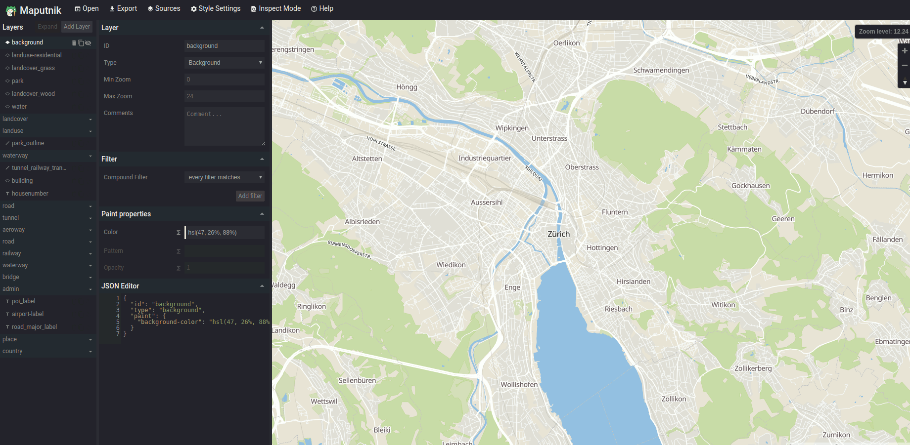

# Cómo simbolizar teselas vectoriales

## Maputnik

Es un editor visual gratuito y abierto para estilos Mapbox GL dirigidos tanto a desarrolladores como a diseñadores de mapas.

Se puede utilizar en línea en [*Maputnik editor*](https://maputnik.github.io/editor/) (todo se guarda en el almacenamiento local) ó se puede hacer una instalación local.

### Instalación 

Si vamos a la página de [*Releases*](https://github.com/maputnik/editor/releases) de Maputnik aparece que la última versión es la v1.0.2. Realmente existe una versión v1.1.0 que está en la página de releases pero que no está marcada como la última versión.

Descagaremos la versión v1.1.0 que es la última versión disponible para la fecha de este taller. 

```
wget https://github.com/maputnik/editor/archive/v1.1.0.tar.gz
tar -xzvf archivo.tar.gz
```

Vamos a la carpeta *editor-1.1.0* creada al descomprimir el archivo descargado he instalamos las dependencias del Maputnik

```
cd editor-1.1.0
npm install
```

Al finalizar la instalación comprobamos que no aparezca ningún error (pueden aparecer algunos WARN) y arrancamos el servidor de Maputnik

```
npm start
```

Abrir el navegador y escribir http://localhost:8888 y comprobar que aparece la página del Maputnik


*Maputnik*

## Estilizar el mbtiles

### Agregar un origen de datos (Source)

En el editor del Maputnik en la barra de menú seleccionamos la opción de **Source** para desplegar el dialogo de gestionar fuentes de datos. En la parte inferior del diálogo esta el apartado para agregar una fuente nueva de datos *Add New Source*. Para agregar nuestra fuente de datos mbtiles tenemos dos opciones.

1. Vector (TileJSON URL)
Source ID: identificador único de la capa: es el nombre que utilizaremos como referencia en las capas. En nuestro caso pondremos *natural_earth*
Source Type: tipo de la fuente de datos. Seleccionar la opción de Vector (TileJSON URL)
TileJSON URL: url del archivo JSON de descripción de la fuente. Pondremos la url de nuestro TileServerGL http://localhost:8181/data/natural_earth.json


2. Vector (XYZ URL)
Source ID: identificador único de la capa: es el nombre que utilizaremos como referencia en las capas. En nuestro caso pondremos *natural_earth_1*
Source Type: tipo de la fuente de datos. Seleccionar la opción de Vector (XYZ URL)
TileJSON URL: url del servicio de teselas. Pondremos la url de nuestro TileServerGL http://localhost:8181/data/natural_earth/{z}/{x}/{y}.pbf
Min Zoom: 0
Max Zoom: 5
