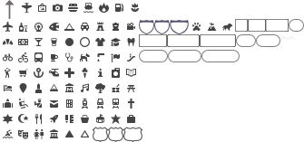
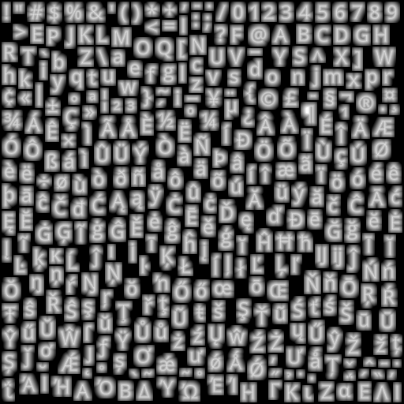

# Sprites y Glyphs

## Sprites

!!! quote "Definición"
    Un **sprite** es una imagen individual que contiene todos los iconos incluidos en un estilo. Al combinar muchas
    imágenes pequeñas en una sola imagen (sprite), se puede reducir el número de solicitudes necesarias para recuperar
    todas las imágenes, mejorar el rendimiento y hacer que el mapa sea más rápido.

    Los Sprites pueden tener un tamaño máximo de 1024x1024 píxeles (o 2048x2048 para pantallas con alta DPI).
    Cada sprite viene acompañado de un archivo JSON donde se define el nombre de cada icono, y su posición y tamaño
    para saber cómo "recortarlo" de la imagen común.
    
    Más información en sobre sprites https://www.mapbox.com/help/define-sprite/


Cada uno de los iconos contenidos en un sprite se puede usar como textura para el fondo del mapa, patrón de relleno para
un polígono, patrón de dibujo para una línea, o una imagen de icono (símbolo puntual).

La propiedad `sprite` de un estilo apunta a una URL **incompleta**, a partir de la cual se pueden encontrar los diferentes
ficheros (sprites y json complementario).

Por ejemplo, si en el `style.json` se indica:

```json
{
    ...
    "sprite": "http://localhost:8081/styles/osm-bright/sprite"
}
```

En realidad dicha URL no existe. Pero sí existen los siguientes recursos (añadiendo `.png`, `.json`, `@2x.png` y `@2x.json` respectivamente):

* http://localhost:8081/styles/osm-bright/sprite.png Sprite a resolución convencional
* http://localhost:8081/styles/osm-bright/sprite.json JSON que define cada icono dentro del sprite
* http://localhost:8081/styles/osm-bright/sprite@2x.png Sprite a resolución doble (para pantallas Retina)
* http://localhost:8081/styles/osm-bright/sprite@2x.json JSON que define cada icono dentro del sprite de resolución doble

Ejemplo de sprite:




Uno de los elementos definidos en el JSON:

```json
{
    ...
    "airport_11": {
        "height": 17,
        "width": 17,
        "x": 17,
        "y": 0,
        "pixelRatio": 1
    },
    ....
}
```

### Cómo crear tus propios sprites

Para generar los sprites a partir de imágenes individuales hay que crear los cuatro archivos. Esto se podría hacer
manualmente con un editor de texto, un editor de imágenes y mucha paciencia, pero afortunadamente existen herramientas
que lo automatizan. 

Los sprites convencionales para la web difieren de los de Mapbox, ya que utilizan una imagen compuesta `png` y un archivo
`css` con las reglas de simbolización para su aprovechamiento en páginas web. Mapbox GL, en cambio, necesita el fichero
`json`, no un CSS. 

Para generar los sprites y sus json a partir de una colección de imágenes en formato SVG, se recomienda el uso de la
librería de Mapbox [spritezero-cli](https://github.com/mapbox/spritezero-cli), de la siguiente manera:

```bash
cd datos
npm install -g @mapbox/spritezero-cli
spritezero sprites iconos-maki-svg
spritezero --retina sprites@2x iconos-maki-svg
```

Una vez generados, los movemos al directorio donde residirá el estilo que los use (en nuestro caso, `natural-earth`):

```bash
mkdir ../tileserver/styles/natural-earth
mv sprites* ../tileserver/styles/natural-earth
```


## Glyphs

En la propiedad `glyphs` se indica una plantilla de URL para cargar tipografías en formato PBF, que se usarán para
dibujar etiquetas en el mapa. Por ejemplo:

```json
{
    ...
    "glyphs": "http://localhost:8081/fonts/{fontstack}/{range}.pbf"
}
```

Esta plantilla de URL debe incluir dos tokens:

* `{fontstack}` es el nombre de la tipografía. Por ejemplo `Open Sans Bold`.
* `{range}` es un rango de 256 puntos de código Unicode (es decir, un subconjunto de letras o símbolos). En función del texto a mostrar, el visor solicitará los rangos necesarios. El primero es `0-255`.

Una petición real tendría la forma:

* http://localhost:8081/fonts/Open%20Sans%20Bold/0-255.pbf

Un glyph contiene una derivada de la tipografía binaria que permite escalarla sin el pixelado, y sería una imagen en
 escala de grises con este aspecto:




### Cómo crear tus propios glyphs

Descargar el proyecto de github `openmaptiles/fonts`

```bash
cd ~/Desktop/taller-vt/
wget https://github.com/openmaptiles/fonts/archive/master.zip
unzip master.zip
cd fonts-master
npm install
node generate.js
```

Al cabo de un rato, podemos ver los resultados en el directorio `_output`.

Si no queremos generar una tipografía determinada, basta con borrar el directorio que la contiene.
Del mismo modo podemos añadir tipografías añadiendo nuevos directorios y copiando dentro las tipografías en
formato TTF. Por ejemplo, para generar "Comic Sans":

```bash
rm -rf metropolis noto-sans open-sans pt-sans roboto
cp -r ../datos/comic-sans-ms .
node generate.js
```

El directorio `_output` no se borra entre ejecuciones, con lo que habremos conservado todas las fuentes anteriores,
además de la recién generada "Comic Sans".

Finalmente, copiaremos el contenido de `_output` al directorio `tileserver/fonts`:

```bash
cp -r _output/* ../tileserver/fonts
```

Habrá que reiniciar el tileserver para que cargue las nuevas tipografías.

Podemos ver una lista de las tipografías disponibles en el servidor en la dirección http://localhost:8081/fonts.json


## Ejercicio extra: Generar una tipografía a partir de un conjunto de iconos en SVG

Si queremos disponer de una colección de iconos monocromáticos de forma más flexible que usando
sprites, los podemos convertir en una tipografía. Esto permitirá aplicar las técnicas de las etiquetas de texto a
nuestros símbolos, como escalarlos sin apreciar pixelado, cambiar su color de base, añadir un halo, etc. 

Para transformar un conjunto de iconos SVG en una fuente se pueden utilizar diferentes programas.
Aqui un listado de algunas webs que permiten generar fuentes:

* https://icomoon.io
* http://fontello.com/
* https://glyphter.com/
* http://fontastic.me/

También podemos generar una fuente propia utilizando el repositorio https://github.com/gencat/ICGC-fonticon-generator,
de la siguiente manera:


```bash
git clone https://github.com/gencat/ICGC-fonticon-generator
npm i -g gulp
cd ICGC-fonticon-generator/
npm install
gulp iconfont
```

Una vez generada la fuente, que encontraremos en `iconfont/Geostart-Regular.ttf`, podemos generar los glyphs como se ha
explicado en el apartado anterior, y añadirlos al tileserver.
